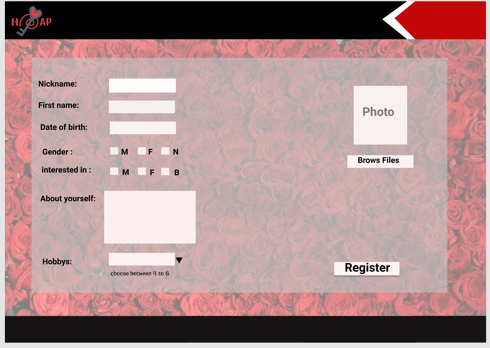
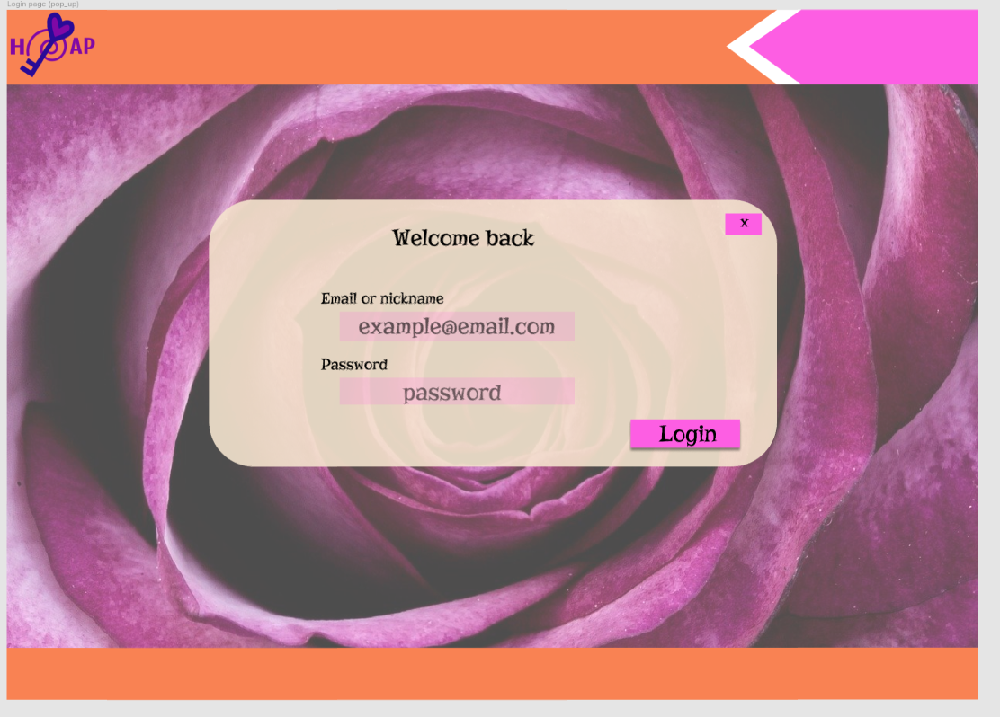

# npProject
personal project

Creation of a Plattform to meet new people. 
You can select people in the "Matching Gallery" and contact them via messages.

**Coded with following languages:** 
> HTML 
> CSS 
> JavaScript 
> PHP (OOPs) 
> SQL  
> usage of API (profile api, sunset/sunrise api (to change css in function on daytaime) 

**How the page will look like:**

## first impression 

## Register

## Login

## Profile

## Gallery

## Frame

 
## Pop_up message

## DB scheme:

**What is static, or not?**

*first impression:* photos= not static; text=static  
*Register:* static  
*Login:* static  
*Profile:* not static (charge from DB)  
*Gallery:* not static (charge from DB)  
*Frame:* not static (charge from DB)  
*pop_up message:* not static (charge from DB)  

*Header:* semi static (displays user information and logout)  
*Footer:* static 

